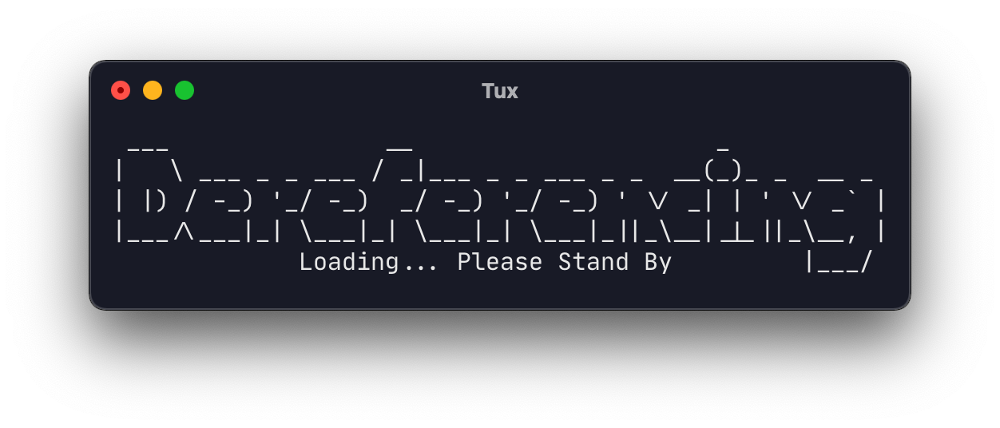
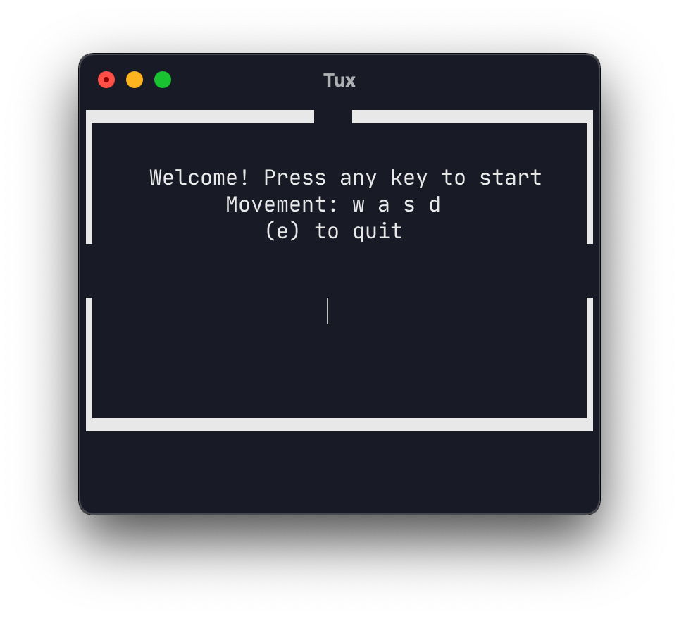
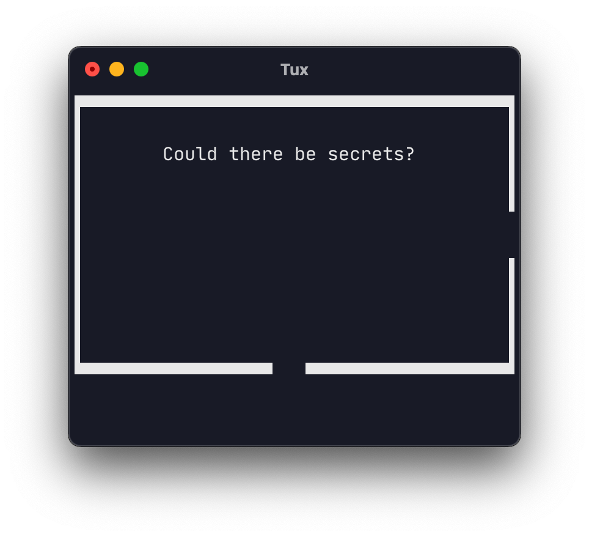

# Dereferencing - Adventure game
Small retro-like adventure game written in C.

# How to play:
- Compile the game from source (adventure.c)
- Free the princess and find the easter egg

# Movement:
- w,a,s,d : Move left, up, down, right
- e : Quit the game

# How to compile:

Compile the source code with gcc:
```bash
gcc -o adventure adventure.c
```

Run the compiled binary
```bash
./adventure
```

# Pictures




